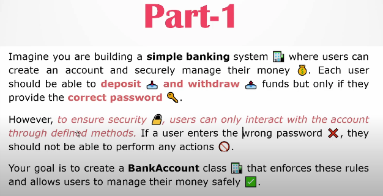
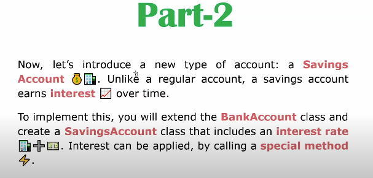

# A Banking App





```python

class BankAccount:
    def __init__(self, account_number, password, balance=0):
        self.account_number = account_number
        self.__password = password
        self.__balance = balance
        self.__history = []

    def deposit(self, amount, password):
        if password != self.__password:
            print("Access Denied!!")
            return
        if amount > 0:
            self.__balance += amount
            self.__history.append(f"Deposited ${amount}")
            print(f"Deposited ${amount}.\nNew balance: ${self.__balance}")
        else:
            print("Abey taka age de!!")

    def withdraw(self, amount, password):
        if password != self.__password:
            print("Access Denied!!")
            return
        if 0 < amount <= self.__balance:
            self.__balance -= amount
            self.__history.append(f"Withdrew ${amount}")
            print(f"Withdrew ${amount}.\nNew balance: ${self.__balance}")
        else:
            print("Apnar taka nai!!")

    def show_history(self):
        print("Transaction History:")
        for i, t in enumerate(self.__history, 1):
            print(f"{i}. {t}")

    def get_balance(self, password):
        if password != self.__password:
            print("Access Denied!!")
        else:
            return self.__balance


class SavingsAccount(BankAccount):
    def __init__(self, account_number, password, balance=0, interest_rate=0.05):
        super().__init__(account_number, password, balance)

        self.interest_rate = interest_rate 

    def apply_interest(self, password, special_password):
        if special_password == "abc@123":
          interest = self.get_balance("asdf") * self.interest_rate
          print(f"interest of ${interest:.2f} applied to {self.account_number}'s savings account.")
        else:
            print("Emne interest pawa jay na!! Get Your Special Password from Bank.") 


# bracbank = BankAccount("24311", "asdf", 5000)
# bracbank.deposit(400, "asdf")
# bracbank.withdraw(800, "asdf")
# bracbank.show_history()
# bracbank.check_balance("asdf")

bracsavings = SavingsAccount("101","asdf",6000)
bracsavings.deposit(1000,"asdf")
bracsavings.withdraw(200,"asdf")
bracsavings.apply_interest("asdf","abc@123")

```